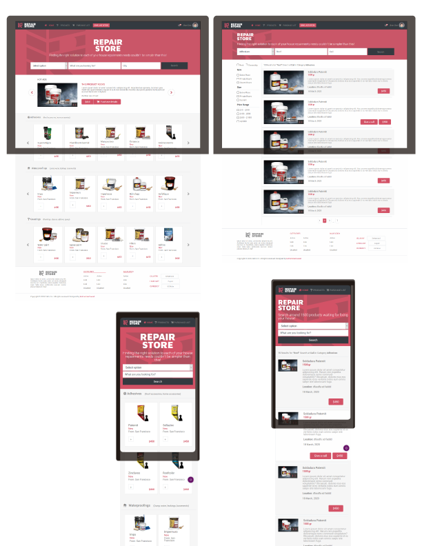

# HTMK & CSS Capstone project - Online Repair Store

> Project for an online shop for home repairments. The design followed is a nice work of [Mohammed Awad](https://www.behance.net/gallery/24796463/ZATTIX), but with personalized content. In this work, I am going to demonstrate my skills gained during Microverse HTML and CSS first section of the main curriculum.




## Concept of the shop

The store is an e-commerce site offering products that help us with repairments at home, when you need to patch a leaking on the roof, stick a loose roof shingle, render a brick wall, etc. Comes with a set of carousels, displays a responsive functionality and has two pages: homepage and search results page.

## Built With

```
- [Bootstrap 4](https://getbootstrap.com/)
- Flexbox Box layout module
- Used some CSS styles to override Bootstrap styles when necessary to adapt it to the constraints of the proposed design.
```


## Live Demo

[Live Demo Link](https://mystifying-newton-71c7bd.netlify.com/)


👤 **Author**

- Github: [@githubhandle](https://github.com/maosan132)
- Twitter: [@twitterhandle](https://twitter.com/maosan132)
- Linkedin: [linkedin](https://www.linkedin.com/in/mauricio-santos-a7292910)


## 🤝 Contributing

Contributions, issues, and feature requests are welcome!

Feel free to check the [issues page](issues/).

## Show your support

Give a ⭐️ if you like this project!

## Acknowledgments

- Hat tip to anyone whose code was used
- Inspiration
- etc

## 📝 License

This project is [MIT](lic.url) licensed.

FREE SOFTWARE ROCKS!
